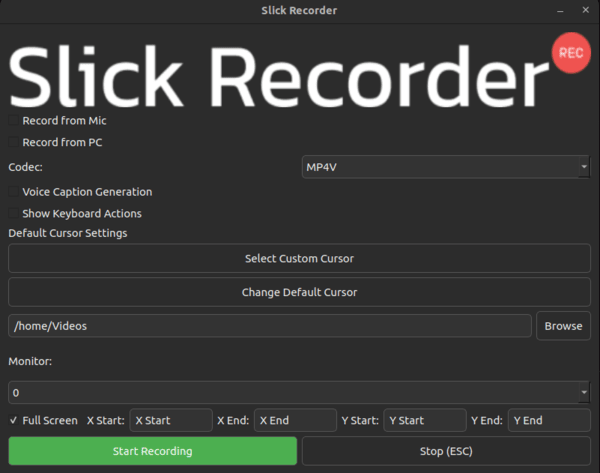

# Slick Recorder

**Slick Recorder** is a lightweight and stylish recording application designed specifically for Linux. It offers a sleek user interface and powerful features to make your recording experience seamless and enjoyable.

  
*Screenshot of Slick Recorder in action*

## Features

- **Noise Reduction**: Automatically reduces background noise for clear audio recordings.
- **Keyboard Input Display**: Show your keyboard inputs in the recordings.
- **Subtitle Generation**: Generate subtitles for your recordings effortlessly.
- **Lightweight GUI**: A cool and minimalistic graphical interface to manage all your recording tasks.
- **Custom Cursors**: Personalize your recording experience with custom cursor options.

## Requirements

To use Slick Recorder, ensure you have the following installed:

- **PulseAudio**: For handling audio streams.
- **FFmpeg**: For audio and video processing.

## Installation

You can install Slick Recorder via pip. Run the following command to get started:

```bash
pip install SlickRecorder
```
## License

Slick Recorder is released under the MIT License. See the [LICENSE](LICENSE) file for more information.

## Acknowledgments

All Cursor PNG images used in this project are sourced from [flaticon.com](https://www.flaticon.com/).
